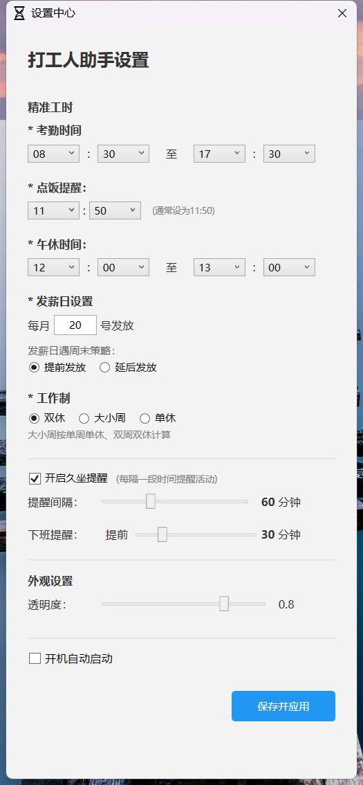

# ⚡ CyberSlacker (赛博摸鱼员)

> 掌控搬砖时间的终极逻辑。

> **“钱是老板的，命是自己的。”** —— 这是一个真正懂打工人的桌面贴心挂件。

打工人助手是一款基于 **WPF (.NET 8)** 开发的桌面小组件。它不仅仅是一个简单的倒计时器，更集成了复杂的中国节假日调休算法、发薪日智能策略以及各种幽默的打工人语录，旨在为您枯燥的办公生活增添一份仪式感。

---

## 📸 界面预览

| 主挂件界面 | 设置中心 |
| :---: | :---: |
|  |  |
| *半透明磨砂质感，全屏自由拖动* | *精细化考勤与提醒配置* |

---

## ✨ 核心亮点

*   **🛡️ 真正“不死”的挂件**：
    *   采用底层 Win32 样式补丁，即使按下 `Win+D` 显示桌面，挂件依然稳如泰山。
    *   **锁定模式**：开启后点击穿透，不抢占焦点，像壁纸一样静静存在。
*   **📅 智联节假日 API**：
    *   集成 `Timor.tech` 接口，自动同步法定节假日。
    *   **补班感知**：完美识别“调休导致的周六日上班”，倒计时绝不漏算。
*   **⏰ 净工时倒计时**：
    *   支持自动扣除**午休时间**及**周期性小憩**时间，显示真正的剩余“搬砖”秒数。
*   **💰 智能发薪日**：
    *   **策略调整**：发薪日遇周末？可选“提前发放”或“延后发放”，逻辑严密。
*   **🎨 现代感交互**：
    *   **彩色 Toast 通知**：下班、点餐、久坐提醒均采用 Windows 10/11 现代彩色通知。
    *   **动态毒鸡汤**：内置海量打工人金句，根据时段随机切换。

---

## 🛠️ 技术栈

*   **运行时**：.NET 8.0 (WPF)
*   **架构模式**：MVVM (Model-View-ViewModel)
*   **三方组件**：`H.NotifyIcon.Wpf`, `CommunityToolkit.Mvvm`, `CommunityToolkit.WinUI.Notifications`

### 📈 摸鱼开发动态

---

## 🚀 快速开始

### 1. 环境准备
*   安装 [Visual Studio 2022](https://visualstudio.microsoft.com/)。
*   确保安装了 **.NET 8.0 SDK**。

### 2. 配置项目属性 (重要)
在运行项目前，请右键点击项目 **属性 (Properties) -> 设置 (Settings)**，添加以下配置项（范围均设为 **User**）：

| 名称 | 类型 | 默认值 | 说明 |
| :--- | :--- | :--- | :--- |
| **WindowLeft** | double | 100 | 挂件在屏幕上的横坐标 |
| **WindowTop** | double | 100 | 挂件在屏幕上的纵坐标 |
| **StartTime** | string | 08:30 | 每天上班时间 |
| **EndTime** | string | 17:30 | 每天下班时间 |
| **MealTime** | string | 11:50 | 点餐提醒时间 |
| **LunchStart** | string | 12:00 | 午休开始时间 |
| **LunchEnd** | string | 13:30 | 午休结束时间 |
| **PayDay** | int | 20 | 每月发薪日期 |
| **PaydayStrategy** | int | 0 | 遇周末策略 (0:提前, 1:延后) |
| **WorkMode** | int | 0 | 工作制 (0:双休, 1:大小周, 2:单休) |
| **RestInterval** | int | 60 | 久坐提醒间隔(分钟) |
| **IsRestEnabled** | bool | true | 是否开启久坐提醒 |
| **PreOffWorkMins** | int | 30 | 临近下班的“跑路预警”提前量 |
| **IsAutoStart** | bool | false | 是否随系统启动 |
| **IsLocked** | bool | false | 是否开启点击穿透/锁定 |
| **Opacity** | double | 0.8 | 挂件不透明度 (0.1 - 1.0) |
| **HolidayCacheJson** | string | (留空) | 节假日数据缓存 |
| **LastHolidayUpdate** | DateTime | 2000-01-01 | 上次同步 API 的日期 |

### 3. 编译与运行
1. 将你的图标文件命名为 `app.ico` 放入项目根目录。
2. 在 VS 中点击 `app.ico`，属性栏设置 **生成操作 (Build Action)** 为 **资源 (Resource)**。
3. 按 `F5` 启动，组件会出现在设定坐标处，支持全屏自由拖动。

---

## 📜 许可

本项目基于 **MIT License** 开源。

---

> **⚠️ 风险提示**：
> 请务必在老板不在身后时查看倒计时。本软件对因过度摸鱼导致的职场风险概不负责。

**祝各位打工人：早日退休，准点下班！** 🏃💨
